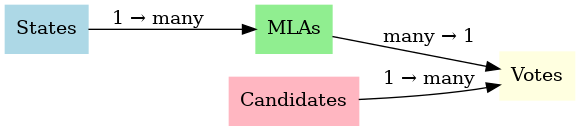

# Indirect Voting System for Indian Presidential Election

## 📌 Overview
This project simulates the **indirect voting system** used in India to elect the President.  
It is implemented in **MySQL** with proper ER-model, normalization, and queries.

## 🛠 Tools & Technologies
- MySQL Workbench
- ER Diagram
- SQL Queries

## 📂 Database Design
- **States** → Contains list of states.
- **Candidates** → Contesting candidates.
- **MLAs** → Belongs to states, has a weighted vote.
- **Votes** → Stores voting record (MLA → Candidate).

## 🔗 ER Diagram

## 📊 Example Queries
- Count total votes for each candidate.
- Count weighted votes (population-based value).
- Find final **Winner**.

## ✅ Outputs
- Lekhesh → 10 weighted votes  
- Gayathri→ 6 weighted votes  
- Suchithra → 3 weighted votes  
- **Winner = Lekhesh(Party A)** 🎉
